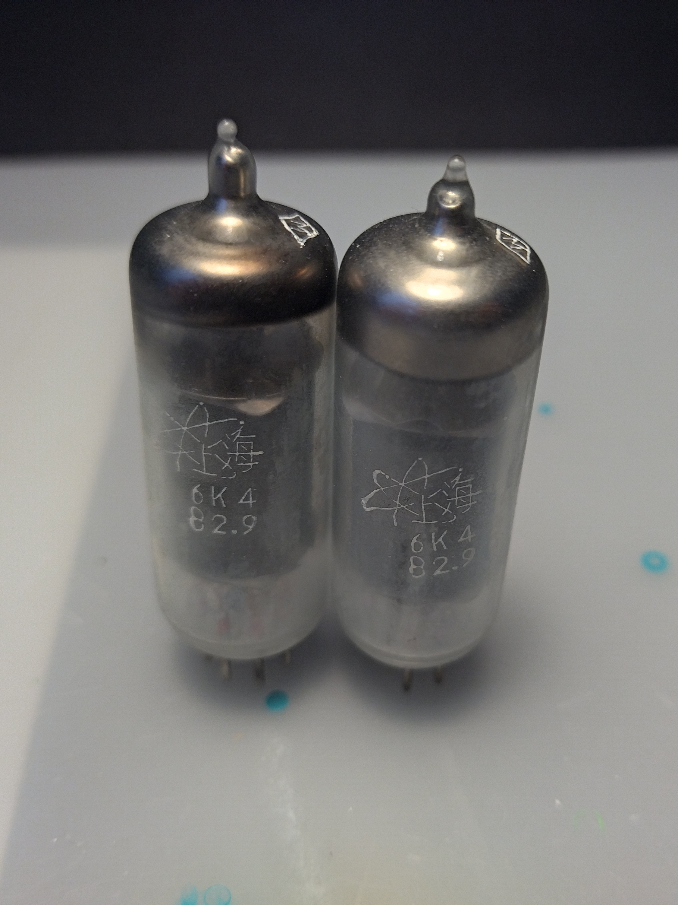

# fxaudio-tube-03

A dedicated page for reverse engineering the FXAudio Tube-03 preamp.

 

## Tubes

Comes with a 6K4 (EF95) Chinese vacuum tubes.

### Compatible Tubes

The compatible tubes found on the internet are:

6J1, 6ж1П, 6AK5, 6BC5, 403A/B, 5654, EF95, CV850, 6J2, 6ж2П, 6AS6, CV2522, CV4011, 6J3, 6ж3П, EF94, CV848, 6BC6, 6AG5, 6J4, 6ж4, 6136, 6BX6, 6AC7, 6AU6, 6J5, 6ж5П, CV2521, 6F36, 6AH6, 6AN5, 6K4, EF93, 6K5, 6K4П, 6BA6, 6DA6, 5749 ([reference](https://doukaudio.com/products/mini-vacuum-tube-headphone-amplifier-hifi-stereo-desktop-audio-pre-amplifier))

Vokshod 6J1P-EV  ([reference](https://drop.com/buy/fx-audio-tube-03-preamp-buffer/talk/2725241?utm_source=linkshare))
6ZS1P-EV  ([reference](https://prohardver.hu/tema/fulhallgato_erositok_dacs_headamps_headphone_amplifiers/hsz_87015-87015.html))

6J1, 6AK5, 6AJ5, 5654, 403B, 6096, M8100 ([reference](https://www.youtube.com/watch?v=AL3K0mO1Iok))

### Tube Socket

Using [B7G](http://www.r-type.org/static/baseb7g.htm) sockets for tubes.

## Op-Amps

Using two NE5532P dual op-amps as the stock configuration ([datasheet](https://www.ti.com/lit/ds/symlink/ne5532a.pdf))

### Possible op-amp upgrades

- AD827JN+MUSES8820 ([reference](https://www.youtube.com/watch?v=S-pgNuk6AKQ))
- MUSES8920D+LM4562 ([reference](https://forum.hifiguides.com/t/chinese-tube-power-pre-amps-tube-buffers/6646/165))
- MUSES8920, LM49860, LM4562, Burson V5i-D, Sparkos SS3602 ([reference](https://drop.com/buy/fx-audio-tube-03-preamp-buffer/talk/2731379?utm_source=linkshare))
- AD8672 and LM4562 ([reference](https://audiokarma.org/forums/index.php?threads/fx-audio-6j1-tube-preamp-a-31-wonder.848535/page-224#post-16278998))
- Tone control Sparkos SS3602, volume control AD8066 ([reference](https://audiokarma.org/forums/index.php?threads/fx-audio-6j1-tube-preamp-a-31-wonder.848535/page-233#post-16876546))
- OPA2134PA or TL082CP ([reference](https://www.youtube.com/watch?v=AL3K0mO1Iok))
- Burson V5i-D x2 ([reference](https://drop.com/buy/fx-audio-tube-03-preamp-buffer/talk/2725241?utm_source=linkshare))
- OPA1656 x2 ([reference](https://audiokarma.org/forums/index.php?threads/a-review-of-fx-audio-6j1-tube-preamp-not.916958/post-13849693))
- MUSES01, MUSES02 ([reference](https://toanvoaudio.vn/shop/fx-audio-tube-03-mod-full-opan-hiend-muses01-muses02/))

## Capacitors

### Original capacitor values

#### PSU noise filters

 ID | Type
 -- | ----
E102 | 1000uF 16V electrolytic LOWESR (ChongX VEHT)
E103 | 22uF 250V electrolytic (ChongX VEHT)
E104 | 22uF 250V electrolytic (ChongX VEHT)

#### Input / Output

**Input**

 ID | Type
 -- | ----
C213 | 1uF 450V film (BMPP)
C214 | 1uF 450V film (BMPP)

**Output**

 ID | Type
 -- | ----
E301 | 22uF 250V electrolytic LOWESR (ChongX VEHT)
E302 | 22uF 250V electrolytic LOWESR (ChongX VEHT)
C301 | 1uF 63V film (A1K9)
C302 | 1uF 450V film (BMPP)
C303 | 1uF 63V film (A1K9)
C304 | 1uF 450V film (BMPP)

#### Op-Amp

 ID | Type
 -- | ----
E101 | 100uF 25V electrolytic LOWESR (ChongX VEHT)
E201 | 100uF 25V electrolytic LOWESR (ChongX VEHT)
E202 | 100uF 25V electrolytic LOWESR (ChongX VEHT)
E203 | 10uF 50V electrolytic LOWESR (ChongX VEHT)
E204 | 10uF 50V electrolytic LOWESR (ChongX VEHT)
E207 | 100uF 25V electrolytic LOWESR (ChongX VEHT)

### Changing Onboard Capacitors

#### #1

- 4 x WIMA MKP4 1uF 250v (C213, C214, C302, C304) ⚠️voltage smaller than original
- 2 x WIMA MKS4 1uF 100v (C301, C303) 💡voltage larger than original
- 4 x Nichicon KT 220uF 25v (E101, E201, E202, E207) 💡capacitance larger than original

     

([reference](https://audiokarma.org/forums/index.php?threads/fx-audio-6j1-tube-preamp-a-31-wonder.848535/post-13997979))

#### #2

- WIMA 1uF/63V (C301, C303)
- electrolytic caps from 100uF/16V to 220uF/25V  (E201, E202, E207) 💡voltage larger than original

   

([reference](https://audiokarma.org/forums/index.php?threads/fx-audio-6j1-tube-preamp-a-31-wonder.848535/post-13730561))

#### #3

- Caps are WIMA, Nichicon, and the one Panasonic in the power supply section. ⚠️capacitance not mentioned, not visible
- film caps settling on 1.5uF (C301, C303) ❓not visible
- 2.2uF (C213, C214, C302, C304) ⚠️ voltage less than original
- p/s cap from 1000uF to 2200uF (E102)

  

([reference](https://forum.hifiguides.com/t/chinese-tube-power-pre-amps-tube-buffers/6646/165))

#### #4

- 4 x WIMA MKP4 1uf 250v (C213, C214, C302, C304) ⚠️voltage smaller than original
- 2 x WIMA MKS4 1uf 100v (C301, C303) 💡voltage larger than original
- 4 x Nichicon KT 220uf 25v (E101, E201, E202, E207) 💡capacitance larger than original

([reference](https://audiokarma.org/forums/index.php?threads/fx-audio-6j1-tube-preamp-a-31-wonder.848535/page-130#post-14179389))

#### #5

- Group 1: Wima MKS4 1uF/100V 10% (C213, C214, C302, C304) ⚠️voltage smaller than original
- Group 2: Wima MKS2 2.2uF/63V(C301, C303) 💡capacitance larger than original

([reference](https://audiokarma.org/forums/index.php?threads/fx-audio-6j1-tube-preamp-a-31-wonder.848535/page-224#post-16278998))

#### #6

- replaced the 1.0uF 250V film capacitor with ERO MKT 1822 in parallel with ERO MKP 1837 0.01uF 250V x4  (C213, C214, C302, C304) ⚠️voltage smaller than original
- replaced the 1.0uF 100V film capacitor with a Wima mks2 x2 (C301, C303) 💡voltage larger than original
- replaced the 10uF 50V electrolytic capacitor with a Wima mks2 film capacitor x2 (E203, E204) ❓not visible
- replaced the 22uF 250V electrolytic capacitor with a Rubycon RX30 x4 (E103, E104, E301, E302)
- replaced electrolytic capacitors 1000uF 16V with Elna 1000uF 16V x4 in parallel (E102)💡capacitance larger than original
- replace the plastic tube socket with a ceramic one that has a gold-plated connector x2
- replaced the 100uF 16V electrolytic capacitor with a Panasonic os-con sepc 100uF 16V very low esr solid capacitor x4 (E101, E201, E202, E207)
- replaced the stock tube with Mullard M8100 x2
- replaced the tone control opamp with a sparkos SS3602
- replaced the volume control opamp with an AD8066

    

([reference](https://audiokarma.org/forums/index.php?threads/fx-audio-6j1-tube-preamp-a-31-wonder.848535/page-233#post-16876546))

#### #7

- WIMA MKP4 1.0uF 250V film (C213, C214, C302, C304) ⚠️voltage smaller than original
- WIMA MKS4 1.0uF 100V film (C301, C303) 💡voltage larger than original

   

([reference](https://audiokarma.org/forums/index.php?threads/redux-and-more-fx-audio-6j1-tube-preamp-a-31-wonder.980897/page-3#post-16522331)])

## Power Supply

The unit is shipped with an 12V 1A power supply using a standard P1J connector (DC plug).
  

## Current Modifications

### Tubes

Added Vokshod 6ж1П-EB tubes.

### Op-Amps

Using MUSES8820 for both sockets.

## Manual

[Manual PDF](manual/fx-audio-tube-03-user-manual.pdf)

## Tutorials

- [Tube matching 101](https://tubemaze.info/tube-matching-101)
- [Bias tuning tubes](https://robrobinette.com/How_to_Bias_a_Tube_Amp.htm)

## Forum Threads

- [drop.com](https://drop.com/buy/fx-audio-tube-03-preamp-buffer/talk#discussions)
- [prohardver.hu (Hungarian)](https://prohardver.hu/tema/fulhallgato_erositok_dacs_headamps_headphone_amplifiers/hsz_87015-87015.html)
- [hifiguides.com](https://forum.hifiguides.com/t/chinese-tube-power-pre-amps-tube-buffers/6646/73)
- [farmedia.com](https://farmedia.com/tube-audio-line-level-buffers/)
- [audiokarma.org](https://audiokarma.org/forums/index.php?threads/a-review-of-fx-audio-6j1-tube-preamp-not.916958/page-2#post-14299487)
- [audiokarma.org](https://audiokarma.org/forums/index.php?threads/redux-and-more-fx-audio-6j1-tube-preamp-a-31-wonder.980897/)
- [toanvoaudio.vn](https://toanvoaudio.vn/shop/fx-audio-tube-03-mod-full-opan-hiend-muses01-muses02/)
- [audiosciencereview.com](https://www.audiosciencereview.com/forum/index.php?threads/tube-03.19480/page-2)

